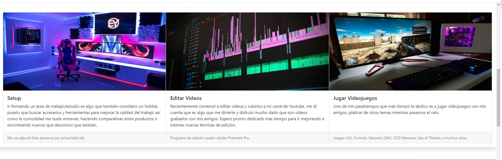

# WebCachi
En esta página se mencionan algunos hobbies del alumno (en este caso yo) actividades que suele realizar y utilizar su tiempo libre. Esto es una actividad para la clase de Administración de Proyectos de Software, de la carrera de Ingeniería en Computación, dentro de la Facultad de Ingeniería, Arquitectura y Diseño, de la Universidad Autónoma de Baja California. Tiene un diseño sencillo y consta de un solo formulario, se implementó de manera que mantuviera un responsive design.

## Tecnologías empleadas en la página

### Se hizo uso de la biblioteca [Bootstrap](https://getbootstrap.com/).

Para ello se implementaron los siguientes códigos:

##### *CSS ONLY*
```
<link href="https://cdn.jsdelivr.net/npm/bootstrap@5.1.2/dist/css/bootstrap.min.css" rel="stylesheet" integrity="sha384-uWxY/CJNBR+1zjPWmfnSnVxwRheevXITnMqoEIeG1LJrdI0GlVs/9cVSyPYXdcSF" crossorigin="anonymous">
```

##### *JavaScript Bundle with Popper*

```
<script src="https://cdn.jsdelivr.net/npm/bootstrap@5.1.1/dist/js/bootstrap.bundle.min.js" integrity="sha384-/bQdsTh/da6pkI1MST/rWKFNjaCP5gBSY4sEBT38Q/9RBh9AH40zEOg7Hlq2THRZ" crossorigin="anonymous"></script>
```


### También se usó la librería [Font Awesome](https://fontawesome.com/).

Se agregó por medio del código:

```
<link rel="stylesheet" href="https://cdnjs.cloudflare.com/ajax/libs/font-awesome/6.0.0-beta2/css/all.min.css" integrity="sha512-YWzhKL2whUzgiheMoBFwW8CKV4qpHQAEuvilg9FAn5VJUDwKZZxkJNuGM4XkWuk94WCrrwslk8yWNGmY1EduTA==" crossorigin="anonymous" referrerpolicy="no-referrer" />
```


### Y 


## Capturas de la página





